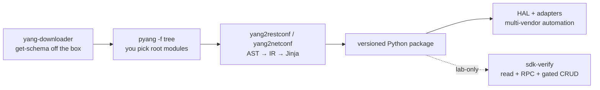

# yang2sdk

Generate a Pydantic v2, IDE-friendly SDK for your network device directly from the YANG modules it actually runs.



- **For network engineers:** [get an SDK in 4 commands](#for-network-engineers) · [write safely](docs/usage.md#netconf-write-safety) · [validate on lab](docs/lab.md)
- **For contributors:** [gates and tests](#for-contributors) · [`docs/dev.md`](docs/dev.md) · [`AGENTS.md`](AGENTS.md)

Both targets share the same navigator intent — `retrieve` / `update` / `replace` / `create` / `delete`, RPC `__call__` — but the per-class surface is asymmetrical by protocol (e.g. RESTCONF plural lists expose `create`, not `update`; NETCONF plural lists expose `update`, not `delete`); only transport/encoding differs (JSON vs XML). See `docs/usage.md` and `AGENTS.md` parity table.

## Example

```python
from g30_1_4_0 import RestconfClient

# Auth comes from args or DEVICE_USER / DEVICE_PASS at runtime.
# Nothing is baked into generated code. verify=True is the default.
client = RestconfClient(management_ip="192.0.2.10")

# Top-level data is "<module>_<node>"; lists take key(s) in `key` order.
iface = client.data.ietf_interfaces_interface("ethernet-1/1")

port = iface.retrieve(content="config", depth=2)
port.description = "uplink-to-core"
iface.update(port)  # PATCH merge — the verb you normally want
```

Pydantic validates on assignment, so the IDE catches bad values before they reach the device:

```python
port.admin_status = "dowm"
# ValidationError: Input should be 'up' or 'down'
```

`replace()` is PUT / `nc:operation="replace"` — the body **is** the whole resource (RFC 8040 §4.5, RFC 6241 §8.2.1). It refuses a depth-truncated model instead of silently deleting the rest; read deeper, use `update()`, or pass `allow_partial=True` when deletion is intended. See [`docs/usage.md`](docs/usage.md).

> [!WARNING]
> **Lab gear only for whole-tree reads.** Never request root `restconf/data/` on production — a large config can spike to 100% CPU and trigger a watchdog reboot or OOM kill. Read a subtree with an explicit `depth` (navigators default to `depth=2`); reserve `depth="unbounded"` for small lab trees.

## For network engineers

Requires Python >= 3.12 and [`uv`](https://github.com/astral-sh/uv).

```bash
git clone https://github.com/ConsortiumGARR/yang2sdk.git
cd yang2sdk
uv sync --locked --extra lab
cp .env.example .env   # never commit .env; DEVICE_USER / DEVICE_PASS live here
```

```bash
uv run yang-downloader
uv run pyang -p temp/yang_modules/<device>/ -f tree temp/yang_modules/<device>/*.yang > temp/yang_tree/<device>.txt
uv run yang2restconf temp/yang_modules/<device>/file1.yang [file2.yang ...] --device <device>
uv run yang2netconf  temp/yang_modules/<device>/file1.yang [file2.yang ...] --device <device>
```

Each compile emits a self-contained package at `temp/<protocol>_clients/<device>_<os-version>/` (client, models, navigators, `pyproject.toml`, README, `MANIFEST.yang-revisions.json`, `py.typed`):

```bash
uv add path/to/temp/restconf_clients/<device>_<os-version>
```

```python
from <device>_<os_version> import RestconfClient  # or NetconfClient
```

One package per device **and** OS version — different YANG revisions produce different models. Next: [compile flags and HAL sketch](docs/usage.md) · [lab validation with `sdk-verify`](docs/lab.md).

## For contributors

```bash
uvx ruff check .
uvx ruff format --check .
uvx ty check
uvx pyrefly check
uv run pytest tests/test_matrix.py   # offline gate: no docker, no device
```

`ruff` is the only linter/formatter. `ty` and `pyrefly` must both pass on `src/` (`temp/` output is excluded). Live-matrix tests need docker / lab gear — see [`docs/dev.md`](docs/dev.md) for the test/CI matrix and [`AGENTS.md`](AGENTS.md) for the normative generator contract.

## Docs

| Doc | Audience | Contents |
| --- | --- | --- |
| [`docs/usage.md`](docs/usage.md) | network engineer | Credentials, transport defaults, NETCONF write safety, RPCs/actions, packaging, HAL |
| [`docs/lab.md`](docs/lab.md) | network engineer | `sdk-verify` tiers and write gates, simulator matrix, SR Linux job |
| [`docs/dev.md`](docs/dev.md) | contributor | Lint, type-check, tests, CI, contribution guardrails |
| [`AGENTS.md`](AGENTS.md) | contributor | Normative generator contract (IR ↔ templates, RFC compliance, safety) |

## Status

Public prototype. Both protocols generate; wire shapes are pinned offline in `tests/test_matrix.py` and exercised live against `notconf` simulators, SR Linux (full vendor tree, non-NMDA), and the Groove G30. Alternatives ([pydantify](https://github.com/pydantify/pydantify), [pyangbind](https://github.com/robshakir/pyangbind)) cover data modelling but not network operations — this project generates models **and** the operation code on top of [pyang](https://github.com/mbj4668/pyang).
